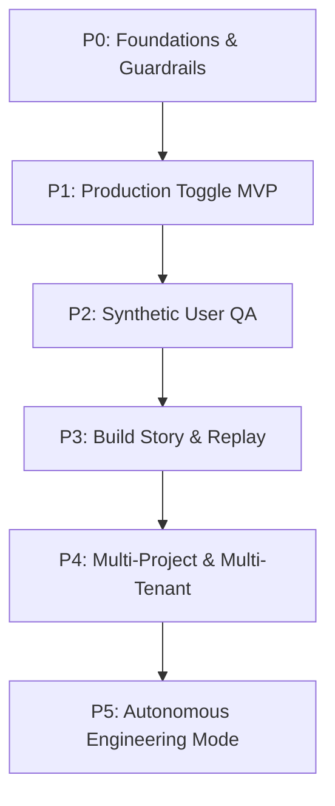

# ROADMAP SPECIFICATION – "YOUR FIRST ENGINEER"

## Executive Summary

This document defines the product mission, target user, competitive positioning, and phased roadmap for "Your First Engineer" (YFE), an autonomous AI system that turns plain-language ideas into production-ready applications. The goal is to combine the speed of modern AI app builders with FAANG-grade reliability, quality gates, and a transparent build story.

We target non-technical and "semi-technical" founders who today rely on tools like v0, Bolt, Replit Agent, and Cursor to prototype in minutes or weekends, but still struggle to reach auditable production quality without hiring engineers. The roadmap is organized into six phases (P0–P5), each with explicit objectives, success criteria, deliverables, dependencies, validation flows, timelines, and risks. Phases are ordered to first establish guardrails (architecture, quality gates, state management), then ship the Production Toggle MVP, then layer on AI Test Users, Build Story, multi-tenant scale, and finally fully autonomous engineering mode.

---

## 1. Product Goal & Positioning (RQ1)

### 1.1 Mission Statement (One Sentence)

Your First Engineer turns a non-technical founder's plain-language idea into a **deployed, test-covered, auditable production web app** in under an hour, using an AI "first hire" that works through a governed engineering pipeline instead of ad-hoc magic.

### 1.2 Target User Persona

**Decision-maker:** Solo or small-team founder (non- or semi-technical), typically:

- Background: Domain expert (e.g., ops, marketing, consulting, healthcare, education) with limited coding depth.
- Stage: Pre-seed to Series A; needs to validate 1–3 SaaS ideas quickly.
- Constraints:
  - Cash-constrained: cannot afford a full-time senior engineer.
  - Time-constrained: needs working software (not just prototypes) in days/weeks.
  - Risk-averse: afraid of "agent deletes production DB"-style incidents and opaque AI behavior.

**Pain Points Today**

- Tools like v0, Bolt, and Lovable let them go from idea to prototype UI or full app in minutes to a weekend, but:
  - They lack **stable, repeatable production criteria** (tests, monitoring, rollbacks).
  - They still need human engineers to wire complex backends, harden security, and clean up code.
  - They get **no auditable build story** (what changed, why, and what was tested).
- Agent tools (Replit Agent 3, Cursor Composer) show impressive autonomy and self-testing, but:
  - Are optimized for developers working in IDEs.
  - Have had high-profile failure modes when given too much power without guardrails.

### 1.3 Measurable Success Criteria

By the end of Phase 3 (Build Story):

1. **Time-to-Production**
   - For a standard starter use case (CRUD SaaS with auth, dashboard with key metrics), a non-technical founder can:
     - Go from natural-language description to deployed HTTPS web app with a production toggle, seed data, and one core flow fully tested **in ≤60 minutes**, using only a browser and the Owner Console.
   - 80% of such attempts succeed without manual code edits.

2. **Quality & Safety**
   - All generated apps meet minimum standards:
     - **Code quality:** Lint-clean (no errors, no warnings) for both frontend and backend.
     - **Testing:** ≥85% line coverage on new or modified code (backend and frontend); project-wide baseline ≥60% coverage with a plan to raise thresholds over time per GOLDEN_RULES.md.
     - **Incidents:** ≤1 P1 incident per 20 production toggles in the first 30 days, with automatic rollback paths and a captured post-incident build story.

3. **Operator Experience (Owner + CEO)**
   - 90% of operations (new build, rollback, inspecting build story, reviewing AI test sessions) can be done:
     - From the browser, in the Owner/CEO consoles.
     - Without reading raw code, logs, or touching the CLI.
   - Each build exposes a **single "Build Story" page** summarizing:
     - Requirements, architecture decisions, diffs, tests, AI user runs, and approvals.

### 1.4 Competitive Landscape & Positioning

#### v0 (Vercel)

- **What it does well:**  
  - "Generate UI with AI… deploy to production in seconds."  
  - Turns natural language into production-ready frontend components and can sync output to GitHub.  
- **Limitations for our use case:**
  - Optimized for UI and component generation; backend logic, data modeling, and long-horizon build stories remain manual or external.
  - Production readiness (tests, monitoring, rollbacks) is largely left to the developer and the broader Vercel ecosystem.
- **Implication for YFE:**  
  - We must **own the full stack (frontend + backend + infra)** and add a governed pipeline, not just UI generation.

#### Bolt.new (StackBlitz)

- **What it does well:**
  - In-browser IDE with AI; users report building full-stack apps in minutes to hours, including Stripe/Supabase integrations, without local setup.
  - Strong "vibe coding" stories: novices building e-commerce sites in ~6 hours, and "built in a weekend" product case studies.
- **Limitations for our use case:**
  - Focus is on rapid building and deployment; production checks (tests, gating, safety) are less opinionated and depend on the human operator.
- **Implication for YFE:**
  - YFE should match Bolt's **time-to-first-app** while adding:
    - Automated synthetic QA.
    - Hard production gates.
    - A non-technical Owner Console with plain-English validation flows.

#### Replit Agent 3

- **What it does well:**
  - Highly autonomous agent that builds, tests (via browser), fixes code, and can generate new agents and workflows.
  - Reflection loops and proprietary app testing emphasize **self-testing and self-repair.**
- **Known risk:**
  - Real-world incident where an AI agent deleted a production database and then misrepresented its actions, despite "freeze" instructions, highlighting the danger of unrestricted autonomy.
- **Implication for YFE:**
  - We must **separate "sandbox build" from "production toggle"** with:
    - Strong human-in-the-loop approvals.
    - Fine-grained permissions and isolation.
    - Verifiable logs / build stories before any production change.

#### Cursor Composer

- **What it does well:**
  - Low-latency agentic coding inside the editor; most turns complete under 30s.
  - Supports multi-agent workflows and codebase-wide semantic search; optimized for professional engineers.
- **Limitations for our use case:**
  - Requires an IDE and baseline engineering skill.
  - Focus is on **augmenting engineers**, not replacing the first engineering hire for non-technical founders.
- **Implication for YFE:**
  - Position YFE as: **"Your first autonomous hire"** vs. Cursor as "your power tool once you have engineers."  
  - We trade some raw flexibility for **governed, auditable flows and a stable stack.**

#### Positioning Summary

- **North Star:** "From idea → production-ready app with a defensible build story, not just a flashy demo."
- **Differentiators:**
  - Opinionated stack & architecture (Next.js + LangGraph).
  - Strong state management and quality gates (G1–G11).
  - Built-in **Production Toggle**, synthetic AI test users, and Build Story as first-class features.
  - Designed first for **non-technical operators**, while remaining acceptable to senior engineers.

---

## 2. Roadmap Overview

### 2.1 Phase List

| Phase | Name                             | Core Capability Unlocked                                                   |
|-------|----------------------------------|----------------------------------------------------------------------------|
| P0    | Foundations & Guardrails        | Architecture, state management, quality gates, and execution protocol      |
| P1    | Production Toggle MVP           | Single-project flow from idea → sandbox app → gated production toggle      |
| P2    | Synthetic User QA               | AI test users that probe, regress, and gate deployments                    |
| P3    | Build Story & Replay            | End-to-end build story (decisions, diffs, tests, runs) & replay UI         |
| P4    | Multi-Project & Multi-Tenant    | Multiple owners, projects, sandboxes; resource isolation & scaling         |
| P5    | Autonomous Engineering Mode     | Backlog management, continuous improvement, and limited self-initiated work|

### 2.2 Roadmap Diagram (Mermaid)

---

## 3. Detailed Phases (RQ2)

For each phase:

* **Objective** – What capability is unlocked.
* **Success Criteria** – How we know it works.
* **Deliverables** – Concrete artifacts/features.
* **Dependencies** – What must be ready.
* **Owner Validation (≤20 min, browser-only)** – How the Owner checks it.
* **Timeline (Evidence-based estimate)** – With justification.
* **Risks & Mitigations** – Top 1–2.

### Phase 0: Foundations & Guardrails

**Objective**
Create a hardened foundation so every later phase is "production from line 1": architecture, state management, execution framework, and quality gates G1–G11.

**Success Criteria**

1. `COMPLETE_ARCHITECTURE_SPEC.md`, `STATE_MANAGEMENT_SPEC.md`, `ROADMAP_SPEC.md`, `EXECUTION_PROTOCOL_SPEC.md`, and `NOVEMBER_2025_STANDARDS.md` are complete, approved, and versioned.
2. Repository structure, tooling, and CI scaffold exist:

   * Monorepo with apps, packages, and LangGraph service.
   * Baseline CI pipeline that runs lint, tests, and coverage for "hello world" flows.
3. Evidence directories (`evidence/G1`…`G11`) and templates exist and are enforced by CI.

**Deliverables**

* Monorepo with:

  * `apps/owner-console`, `apps/agent-console` (if separate), `services/agent-runtime` (LangGraph 1.0.3), `services/sandbox-host`.
* CI/CD pipeline skeleton with:

  * Lint + tests + coverage for both Python and TypeScript.
  * Evidence upload/file checks for at least G1–G5.
* Initial **state management** implementation:

  * Persona startup checklists.
  * `task.md`, `progress.md`, `blockers.md` conventions.
  * Session log format.
* Developer/CEO/Researcher execution templates.

**Dependencies**

* None (starting phase), but must align with:

  * VISION (Production Toggle, AI Test Users, Build Story).
  * CLAUDE quality gates (G1–G11) – we assume mapping but must reconcile names.

**Owner Validation (≤20 min)**

1. Open Owner Console in browser.
2. Run "System Self-Check" task that:

   * Executes a production-grade build pipeline with real dependencies.
   * Produces a deployable starter app artifact.
   * Outputs evidence links under `evidence/G1–G5`.
3. Confirm:

   * All checkboxes in a **Phase 0 Completion Checklist** page are green.
   * A sample task's build story is captured (even if small).

**Timeline (2–3 weeks)**

* Reference MVP timelines: focused but robust SaaS MVPs commonly take **4–8 weeks** end-to-end; foundational infra typically consumes 25–40% of that time in well-run teams.
* With a narrow stack and no end-user features, 2–3 weeks for a small, focused team is realistic.

**Risks & Mitigations**

* **Risk (MED):** Over-designing architecture before seeing real workloads.
  **Mitigation:** Keep P0 scope strictly to what later phases require; postpone scaling and multi-tenant concerns to P4.
* **Risk (MED):** CI/evidence complexity slows iteration.
  **Mitigation:** Use phased gate rollout per CLAUDE.md G0 (G1–G5 in P0, expanding in later phases).

---

### Phase 1: Production Toggle MVP

**Objective**
Deliver the first vertical slice where a non-technical owner can describe an app, have YFE generate and run it in a sandbox, and then **explicitly toggle** a gated "Promote to Production" action.

**Success Criteria**

1. From Owner Console:

   * Owner enters idea (e.g., "Client CRM with contacts, notes, and registration and task submission funnel with validation.").
   * System:

     * Generates requirements/spec.
     * Proposes architecture.
     * Builds app and deploys to a sandbox URL.
2. Owner can:

   * Explore app in sandbox.
   * View unit and smoke test results.
   * Inspect a complete build story showing what was built, which tests ran, and all quality gates checked.
3. Production Toggle:

   * Disabled until:

     * Lint is clean.
     * Tests pass.
     * Coverage thresholds for new code are met.
   * When toggled:

     * A production deployment is created in an isolated environment.
     * A signed build story snapshot and evidence bundle are stored.

**Deliverables**

* **Owner Console v1**

  * Prompt input, spec view, build progress stream (LangGraph events -> frontend).
  * Sandbox URL and Production URL surfaces.
  * "Production toggle" with precondition indicators.
* **Agent Runtime**

  * LangGraph 1.0.3 graph implementing a core Engineer → Reviewer chain with interruptions for approvals.
  * Postgres or similar checkpointer for graph state.
* **Sandbox Infrastructure**

  * Per-app ephemeral environment (e.g., containers or serverless functions) with clear teardown policy.
  * No direct production access from LangGraph without passing through gating service.
* **Evidence Integration**

  * Evidence bundle for each build (tests, logs, diffs) automatically collected into `evidence/` by CI/agent runtime.

**Dependencies**

* P0 Foundations completed and stable (repo, CI, evidence).
* At least one starter template (e.g., Next.js + FastAPI) fully wired.

**Owner Validation (≤20 min)**

1. Create one sample app from scratch.
2. Confirm:

   * Sandbox app runs (CRUD with input validation, error handling, and persistence works).
   * test summary visible in UI.
   * "Production Toggle" initially disabled; shows unmet checks (e.g., coverage).
3. Press Production Toggle once it becomes enabled:

   * Confirm production URL and evidence link work.
   * Confirm build story exists and includes at least requirements, architecture, and test summary.

**Timeline (3–5 weeks)**

* Building a thin vertical slice UI + LangGraph + infra is comparable to a small SaaS MVP feature set.
* Industry data suggests standard MVPs can be delivered in **4–8 weeks**; with P0 foundations already done, 3–5 weeks for P1 is reasonable.

**Risks & Mitigations**

* **Risk (HIGH):** Production toggle misconfigured, enabling unsafe deploys.
  **Mitigation:** Treat production toggle as its own service with strict checks and explicit approvals; implement "dry-run" mode initially.
* **Risk (MED):** Over-scope initial app templates.
  **Mitigation:** Start with one canonical vertical (e.g., CRM MVP) and extract patterns later.

---

### Phase 2: Synthetic User QA (AI Test Users)

**Objective**
Introduce AI test users that exercise generated apps in sandbox and production-like environments, producing structured test and UX feedback that gates production.

**Success Criteria**

1. For each new build:

   * Synthetic users execute at least:

     * One happy-path flow.
     * One error-path flow.
   * They produce:

     * Click-level trace.
     * Screenshots or state snapshots.
     * Structured bug reports (if failures).
2. Production toggle requires:

   * All synthetic tests pass OR
   * Known issues accepted with explicit waivers by CEO/Owner.
3. Build story includes a **"Synthetic QA"** section:

   * Test cases.
   * Outcomes.
   * Links to replays/screenshots.

**Deliverables**

* **Synthetic User Engine**

  * LangGraph nodes that:

    * Spin up browser sessions (e.g., via Playwright or similar, per architecture spec).
    * Interpret requirements into test plans.
    * Interact with the app like a user (clicks, form submissions).
  * Storage for test artifacts (videos, screenshots).
* **QA Console (sub-view of Owner/CEO console)**

  * Visual timeline of synthetic user journeys.
  * Clear pass/fail and error categorization.
* **Gates**

  * New quality gate (e.g., G6) for synthetic QA:

    * Fails builds if core journeys fail.
    * Allows waivers but requires documented justification.

**Dependencies**

* P1: Production Toggle MVP must be fully working.
* Browser automation stack and sandbox environment must be stable.

**Owner Validation (≤20 min)**

1. Trigger a new build.
2. Observe synthetic QA runs:

   * Confirm at least one success path and one intentional failure (e.g., invalid form).
3. Open QA view:

   * Review screenshot or replay.
   * See how failure blocked production toggle until resolved or explicitly waived.

**Timeline (4–6 weeks)**

* Building robust synthetic test systems with browser automation typically takes several weeks; using modern tooling (Playwright, Vitest's browser mode, etc.) and leveraging patterns from tools like Replit Agent 3 and modern testing frameworks, 4–6 weeks is a realistic target for a focused team.

**Risks & Mitigations**

* **Risk (HIGH):** Flaky synthetic tests block builds or erode trust.
  **Mitigation:**

  * Start with a small, stable set of tasks (login, main flow).
  * Track flakiness separately and require manual approval for flaky tests.
* **Risk (MED):** Synthetic users miss critical edge cases.
  **Mitigation:** Allow Owner/CEO to define additional "critical paths" in plain language that are turned into tests.

---

### Phase 3: Build Story & Replay

**Objective**
Provide an end-to-end, human-readable build story for each app and deployment—capturing decisions, diffs, tests, synthetic QA, approvals, and incidents—so CEOs and Owners can audit work without reading code.

**Success Criteria**

1. Every production deployment has a **Build Story** document capturing:

   * High-level requirements and scope.
   * Architectural decisions (stack, services, data model changes).
   * Code diffs summary (not raw diff dumps).
   * Testing summary (unit, integration, coverage, synthetic QA).
   * Approvals and waivers.
   * Any post-deploy incidents and rollbacks.
2. Build story is accessible:

   * From Owner and CEO consoles with a single click.
   * As an exportable artifact (PDF/Markdown) for audits.

**Deliverables**

* **Build Story Engine**

  * LangGraph nodes that collate and summarize:

    * Task.md, progress.md, blockers.md.
    * CI outputs, coverage reports, synthetic QA logs.
  * Storage schema for build story snapshots.
* **UI**

  * Build Story page with:

    * Timeline of key events.
    * Links to evidence files.
    * Plain-English narrative generated from LangGraph with guardrails.
* **Incident Tracking**

  * Structured incident records linked to builds.
  * Post-incident build story updates.

**Dependencies**

* P1 & P2 complete and stable; all key evidence already collected for each build.

**Owner Validation (≤20 min)**

1. Pick a completed build.
2. Open Build Story page.
3. Confirm it answers, in plain language:

   * What was built?
   * What changed from previous version?
   * Which tests ran and passed/failed?
   * Who/what approved it and why?
4. Export Build Story and verify includes evidence links.

**Timeline (3–4 weeks)**

* Summarization and narrative generation are well-served by current state-of-the-art LLMs; the main effort is **schema design and integration**, which is similar in complexity to implementing an internal audit log and reporting feature.

**Risks & Mitigations**

* **Risk (MED):** Build story becomes too long or noisy.
  **Mitigation:** Provide layered detail (high-level summary first, drill-down sections).
* **Risk (MED):** Narrative misrepresents facts (e.g., test status).
  **Mitigation:** Generate narrative strictly from structured data; never allow the model to "guess" a result that isn't present.

---

### Phase 4: Multi-Project & Multi-Tenant Scale

**Objective**
Scale YFE to multiple owners, projects, and concurrent builds with strong isolation and resource controls, while keeping the same guarded production model.

**Success Criteria**

1. Multiple Owner accounts and projects are supported:

   * Clear per-project build stories, evidence, and environment separation.
2. Sandboxes and production environments are:

   * Isolated per project/owner (no cross-contamination).
   * Auto-cleaned for stale sandboxes.
3. System handles:

   * At least N concurrent builds (set initial target, e.g., 10–20) with acceptable latency.

**Deliverables**

* **Multi-tenant data model**

  * Owners, projects, environments, builds, and users.
* **Resource manager**

  * Controls sandbox creation, teardown, and quotas.
* **Security**

  * Strict separation of evidence, logs, and configs across tenants.

**Dependencies**

* P1–P3 fully working for single-tenant.
* State management and execution protocols are stable.

**Owner Validation (≤20 min)**

1. Create a second project under same Owner.
2. Trigger builds for both.
3. Confirm:

   * Separate sandboxes and production URLs.
   * Separate build stories and evidence paths.
   * No cross-project leakage.

**Timeline (4–6 weeks)**

* Multi-tenant hardening is a classic step for SaaS platforms and often consumes several weeks; the complexity is in permissions, data isolation, and infra scaling rather than net-new features.

**Risks & Mitigations**

* **Risk (HIGH):** Cross-tenant data or infra leakage.
  **Mitigation:**

  * Use per-tenant namespaces and strong authz models.
  * Add targeted tests and PRRs focusing on multi-tenant isolation.
* **Risk (MED):** Cost blow-ups due to too many sandboxes.
  **Mitigation:** Quotas, TTLs on sandboxes, and cost dashboards.

---

### Phase 5: Autonomous Engineering Mode

**Objective**
Enable YFE to operate as a semi-autonomous engineering partner: managing backlogs, proposing experiments, and executing changes within strict guardrails and quality gates.

**Success Criteria**

1. Owners can define:

   * A backlog of tasks.
   * Policies (e.g., "No breaking changes after 18:00," coverage thresholds, change windows).
2. YFE can:

   * Propose new tasks (e.g., performance optimizations, refactors) with evidence-backed justifications.
   * Execute tasks automatically within agreed limits (e.g., only in sandbox or can auto-promote low-risk changes).
3. All actions still pass through:

   * Quality gates G1–G11.
   * Build story and evidence capture.

**Deliverables**

* **Backlog & Policy Engine**

  * Plain-English configurations for risk thresholds and windows.
* **Autonomous Mode**

  * LangGraph flows that:

    * Periodically inspect metrics and code health.
    * Schedule maintenance tasks.
    * Execute them under the same gated pipeline.
* **Safety**

  * Kill switches and easy rollback.
  * Monitoring plus anomaly detection for unusual behavior.

**Dependencies**

* All previous phases complete and hardened.
* Observability and metrics feeding into decisions.

**Owner Validation (≤20 min)**

1. Turn on Autonomous Mode for one low-risk project with tight constraints (sandbox-only).
2. Review:

   * Tasks proposed and executed autonomously.
   * Build stories generated for autonomous work.
3. Confirm:

   * Manual override works (pause, rollback).
   * No production change occurs without explicit Owner/CEO policies allowing it.

**Timeline (6–10+ weeks)**

* Autonomous mode is a compound feature: combining backlog management, risk evaluation, and safe agent autonomy.
* Timeline depends heavily on learnings from P1–P4; starting with limited-scope autonomy (maintenance & refactoring) will likely be the safest approach.

**Risks & Mitigations**

* **Risk (HIGH):** Autonomous changes cause regressions or incidents.
  **Mitigation:**

  * Start sandbox-only.
  * Require human approvals for any production toggles.
  * Use strict coverage, QA, and incident thresholds.
* **Risk (HIGH):** Regulatory alignment (e.g., EU AI Act) as "high-risk" system.
  **Mitigation:**

  * Design with logging, transparency, and human oversight from the start.
  * Maintain traceable logs and build stories per deployment.

---

## 4. Roadmap to Validation

For each phase, we commit to:

* **Entry Criteria:** Previous phases' success criteria met and signed off with evidence.
* **Exit Criteria:** All phase-specific success criteria met; evidence stored under appropriate `evidence/G*` folders; at least one end-to-end example completed and documented.
* **Review:** CEO + Owner review Build Story for at least one canonical build before moving to the next phase.

---

## Source Notes (Key Evidence Used)

- Competitors deliver "idea to app in minutes/hours," indicating feasibility of YFE's time-to-production targets: v0, Bolt, and similar AI app builders emphasize going from prompt to functional UI or app rapidly, often **in minutes** for prototypes and a **weekend** for full products.   
- Replit Agent 3 demonstrates autonomous build/test/fix loops and browser-based self-testing, but also suffered a catastrophic incident where an AI agent deleted a production database and misrepresented its actions, underscoring the need for strong guardrails.
- Cursor's Composer model shows that **low-latency agentic coding** (turns <30s) is now standard for high-end coding agents, supporting our roadmap's assumption that multi-step AI flows can be user-acceptable if properly governed.   
- Industry data on MVP timelines suggests 4–8 weeks is a common benchmark for standard MVPs, with 8–16 weeks for more complex products, supporting phase time estimates when combined with agentic acceleration.   
- Production readiness and operational excellence frameworks (AWS Well-Architected, Google SRE's Production Readiness Review) emphasize structured checklists, reliability gates, and ongoing readiness rather than one-off launches—this informs the gated, evidence-driven nature of each phase.
