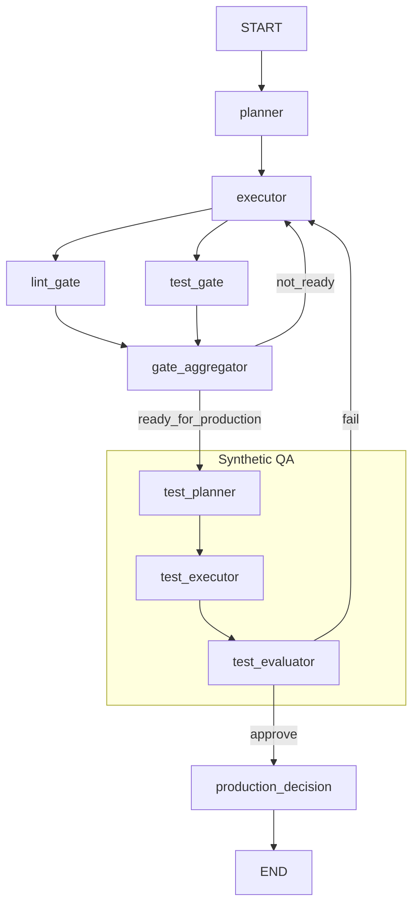

# Architecture: Synthetic QA Engine (MVP)

**Task**: TASK-P2-005-SYNTHETIC-QA-FOUNDATION (Phase B)
**Date**: 2025-11-23
**Status**: ✅ **IMPLEMENTED**

---

## 1. Overview
The Synthetic QA Engine is a native LangGraph extension that automatically verifies task completion using a headless browser. It intercepts the production approval flow, running a generated test plan before allowing deployment.

## 2. New Components

### Nodes
| Node | Type | Responsibility | Inputs | Outputs |
|------|------|----------------|--------|---------|
| `test_planner` | LLM | Generates a JSON test plan based on task & result. | `task`, `result` | `test_plan` |
| `test_executor` | ToolNode | Executes plan using `PlayWrightBrowserToolkit`. | `test_plan` | `test_results`, `screenshots` |
| `test_evaluator` | LLM | Analyzes logs/screenshots to determine Pass/Fail. | `test_results` | `tests_passed`, `test_report` |

### Tools
- **Native**: `navigate_browser`, `click_element`, `extract_text`, `get_elements` (from `PlayWrightBrowserToolkit`).
- **Custom**: `take_screenshot` (uses shared browser context to save images).

## 3. Graph Flow



## 4. State Schema Updates
Added to `AgentState`:
```python
test_plan: dict | None       # JSON plan with steps
test_results: dict | None    # Execution logs
tests_passed: bool | None    # Final verdict
test_report: str | None      # Human-readable summary
```

## 5. Design Decisions
- **Native First**: Used `PlayWrightBrowserToolkit` for 90% of functionality.
- **Sync Browser**: Used synchronous Playwright to avoid `asyncio` loop conflicts within LangGraph nodes (which are async but run in a managed loop).
- **Lazy Loading**: Browser toolkit is lazy-loaded in `test_executor` to avoid overhead on startup.
